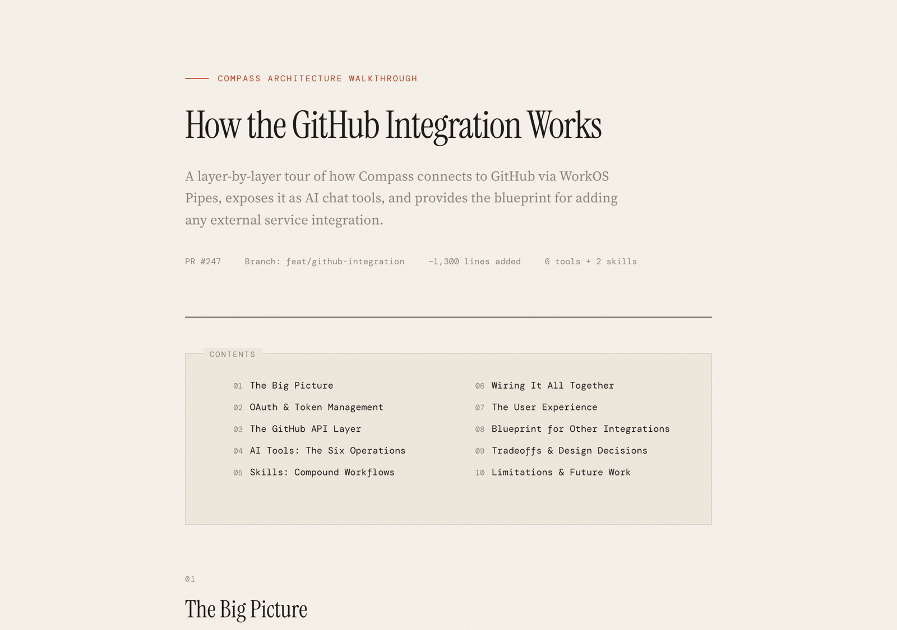

# PR Walkthrough

A [Claude Code](https://docs.anthropic.com/en/docs/claude-code) skill that generates beautiful, self-contained HTML walkthroughs of pull requests.

Instead of reading diffs line by line, get a narrative explanation of *what* changed, *why* it was designed that way, and *how* the pieces connect — presented as a polished technical article.

<!-- TODO: Add screenshot -->


## What It Generates

A single self-contained HTML file with:

- **Narrative structure** — Sections build understanding incrementally, from big picture to implementation details
- **Real code excerpts** — Actual code from the PR with syntax highlighting, not pseudocode
- **Architecture diagrams** — Flow diagrams, layer stacks, and sequence diagrams showing how components connect
- **Annotated tradeoffs** — Why this approach was chosen over alternatives
- **Extension recipes** — How to add a similar feature following the same patterns

The design aesthetic is editorial — think Stripe engineering blog post, not GitHub diff view.

## Design System

The walkthrough uses a warm paper theme with an editorial typography stack:

- **Instrument Serif** — Display headings
- **Source Serif 4** — Body text
- **DM Mono** — Code, labels, metadata

Components include flow diagrams, layer stacks, callout boxes (insight/warning/pattern/tradeoff), comparison tables, file trees, and syntax-highlighted code blocks. See `templates/reference-walkthrough.html` for the full component library.

## Install

Copy the skill into your Claude Code skills directory:

```bash
# Clone the repo
git clone https://github.com/houshuang/pr-walkthrough.git

# Copy to your Claude Code skills directory
cp -r pr-walkthrough ~/.claude/skills/pr-walkthrough
```

Or if you prefer to keep it as a symlink:

```bash
ln -s /path/to/pr-walkthrough ~/.claude/skills/pr-walkthrough
```

## Usage

From any git repository with a PR or feature branch checked out:

```
> walk me through this PR
> explain the changes on this branch
> create a walkthrough of the authentication feature
> deep dive into how the new caching layer works
```

The skill will:
1. Research all changed files and git history
2. Plan a narrative structure
3. Generate a self-contained HTML file
4. Open it in your browser

The output file lands in the project root as `{topic}-walkthrough.html`.

## How It Works

The skill instructs Claude Code to follow a structured workflow:

1. **Research** — Read all changed files (not just diffs), trace data flow, understand the full context
2. **Plan** — Structure the walkthrough as a teaching document with sections for architecture, implementation, wiring, tradeoffs, and extension patterns
3. **Write** — Generate a self-contained HTML page using the design system from the reference template
4. **Deliver** — Save and open in the browser

The reference template (`templates/reference-walkthrough.html`) serves as both a design system reference and a content example. Claude Code reads it before generating each walkthrough to match the aesthetic and component patterns.

## Examples

See the `examples/` directory for sample walkthrough outputs.

## License

MIT
